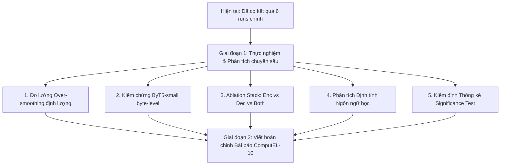

# PROJECT CONTEXT & ROADMAP

> **Tài liệu lưu trữ ngữ cảnh nghiên cứu, hiện trạng thực nghiệm và kế hoạch triển khai của dự án CLRR.**  
> *Cập nhật lần cuối: 26/09/2026*

---

## 1. Tổng quan Dự án & Mục tiêu Học thuật

* **Tên đề tài / Tiêu đề bài báo:**  
  *Parameter-Neutral Context-Encoder Residual Rewiring for JEPA-Guided Low-Resource Amis-to-Chinese Translation*  
  *(hoặc: When the Same Layers Learn to Translate: Parameter-Neutral Residual Rewiring for Low-Resource Amis-to-Chinese Translation)*
* **Hội thảo mục tiêu:**  
  **ComputEL-10 (The 10th Workshop on the Use of Computational Methods in the Study of Endangered Languages)** - năm 2027.
* **Cặp ngôn ngữ nghiên cứu:**  
  *Amis (Pangcah / A-mỹ)* $\to$ *Tiếng Trung (Mandarin - Chinese)*.
* **Đặc thù ngôn ngữ học (Linguistic Context):**  
  * Tiếng Amis là ngôn ngữ bản địa Nam Đảo (Austronesian / Formosan) tại miền Đông Đài Loan, được UNESCO phân loại là ngôn ngữ có nguy cơ mai một (endangered language).
  * Hình thái học cực kỳ phong phú và phức tạp: mang tính **đa tổng hợp (polysynthetic)** và **chắp dính (agglutinative)** cao, sử dụng hệ thống phụ tố ngữ pháp dày đặc (voice affixes: `-om-`, `mi-`, `-en`, `ma-`; aspect markers; reduplication).
* **Vấn đề cốt lõi & Giả thuyết nghiên cứu:**  
  * **Thiếu hụt dữ liệu cực đoan:** Toàn bộ ngữ liệu song ngữ chỉ có **5.751 cặp câu** (từ corpus của *Zheng et al., 2022*).
  * **Representation Over-smoothing:** Trong các kiến trúc Transformer sâu (như mT5, mBART), các tầng Encoder sâu có xu hướng làm mờ (over-smooth) các đặc trưng hình thái - cú pháp tinh vi ở tầng nông thành các biểu diễn ngữ nghĩa trừu tượng chung chung, làm mất thông tin phụ tố của tiếng Amis trước khi truyền sang Decoder.
  * **Hạn chế của Parameter-Efficient Fine-Tuning (PEFT/LoRA/Adapters):** Bổ sung thêm tham số huấn luyện trên tập dữ liệu dưới 6.000 câu rất dễ dẫn đến hiện tượng quá khớp (overfitting).
  * **Giải pháp đề xuất:** Can thiệp thuần túy vào luồng truyền trạng thái ẩn và căn chỉnh không gian ngữ nghĩa mà **hoàn toàn không thêm bất kỳ tham số huấn luyện nào (`extra_parameters = 0`)**.

---

## 2. Phương pháp Đề xuất (Proposed Methodology)

Hệ thống kết hợp 2 thành phần bổ trợ cho nhau:

### 2.1. Context-Encoder Cross-Layer Residual Rewiring (CLRR)
* Áp dụng riêng trên khối **Context Encoder** (nhánh mã hóa câu nguồn Amis).
* Ở mỗi tầng $i$, nối tắt trạng thái ẩn từ tầng $i - d$ ($d = 2$) sang tầng $i$ với trọng số tỷ lệ $\alpha = 0.1$:
  $$h_i' = h_i + \alpha \cdot \text{stop\_gradient}(h_{i-d}')$$
* **Đặc tính kỹ thuật:**
  * Dùng `stop_gradient` (`detach()`) để ngăn lan truyền ngược qua các tầng trước đó, giữ cho quá trình tối ưu hóa ổn định hoàn toàn.
  * Triển khai hoàn toàn qua forward hooks trong PyTorch (`CrossLayerResidualRewire`), không can thiệp vào cấu trúc weights gốc.
  * Đưa trực tiếp tín hiệu hình thái ở tầng nông lên tầng sâu, chống lại hiện tượng over-smoothing.

### 2.2. JEPA-Guided Latent Alignment cho NMT
* Lấy cảm hứng từ Joint-Embedding Predictive Architecture (JEPA), bổ sung hàm mục tiêu căn chỉnh trong không gian biểu diễn ẩn thay vì chỉ dựa vào tái tạo token tự hồi quy ở Decoder.
* **Hàm loss kết hợp:**
  $$\mathcal{L} = \mathcal{L}_{\text{NMT}} + \lambda_{\text{JEPA}} \cdot (1 - \text{CosineSimilarity}(\bar{H}_X, \bar{H}_Y))$$
  * $\mathcal{L}_{\text{NMT}}$: Cross-entropy loss tự hồi quy chuẩn.
  * $\bar{H}_X$: Biểu diễn trung bình (masked mean-pool) của câu nguồn Amis từ Context Encoder (đã được CLRR).
  * $\bar{H}_Y$: Biểu diễn câu đích tiếng Trung đóng vai trò anchor (chạy qua Encoder dưới cơ chế `torch.no_grad()`).
  * Cố định trọng số $\lambda_{\text{JEPA}} = 0.1$.
  * Neo không gian ngữ nghĩa Amis vào không gian tiếng Trung mà không phát sinh thêm tham số nào.

---

## 3. Hiện trạng Thực nghiệm & Kết quả Đạt được

Toàn bộ ma trận thí nghiệm chính (Focused 6-Run Setup) đã được hoàn thành trên GPU A100 với quy chuẩn công bằng cố định (Fixed Fairness Protocol: Seed 42, AdamW, effective batch size 256, max 20 epochs, early stopping 4, SacreBLEU `tokenize="zh"`, chrF++ word order 2):

### Bảng kết quả chính thức (Test Set)

| Backbone | Phương pháp (Method) | Vai trò trong nghiên cứu | BLEU (zh) | chrF++ |
| :--- | :--- | :--- | :---: | :---: |
| `google/mt5-small` | **Baseline** | Standard Seq2Seq (CE) | 2.81 | 4.49 |
| `google/mt5-small` | **CLRR-Enc** | Context-Encoder Rewiring only | 4.50 *(+1.69)* | 5.90 *(+1.41)* |
| `google/mt5-small` | **JEPA** | Latent Alignment only | 4.66 *(+1.85)* | 5.22 *(+0.73)* |
| `google/mt5-small` | **JEPA + CLRR-Enc** | **Proposed Method** | **5.17** *(+2.36)* | **5.76** *(+1.27)* |
| `facebook/mbart-large-50` | **Baseline** | Translation Baseline | 20.09 | 15.72 |
| `facebook/mbart-large-50` | **JEPA + CLRR-Enc** | **Cross-Architecture Validation** | **20.81** *(+0.72)* | **16.56** *(+0.84)* |

### 💡 Đánh giá học thuật từ số liệu:
1. **Hiệu ứng độc lập & cộng hưởng trên `mT5-small`:**  
   * Cả CLRR-Enc (+1.69 BLEU) và JEPA (+1.85 BLEU) đều chứng minh được giá trị độc lập rõ rệt so với Baseline.  
   * Khi kết hợp (JEPA + CLRR-Enc), điểm BLEU tăng vọt lên **5.17** (**tăng +84.3% tương đối** so với Baseline). Điều này chứng minh 2 cơ chế tương hỗ mạnh mẽ: CLRR giữ gìn biểu diễn hình thái, còn JEPA định hướng không gian tiềm ẩn.
2. **Tính tổng quát hóa trên `mBART-50`:**  
   * mBART-50 vốn là mô hình lớn (611M params) được huấn luyện chuyên sâu cho dịch thuật. Trên mô hình này, phương pháp đề xuất vẫn tiếp tục cải thiện cả BLEU (+0.72) và chrF++ (+0.84), chứng minh phương pháp không phụ thuộc vào một kiến trúc duy nhất.

---

## 4. Các Lỗi Kỹ thuật Đã Xử lý Trong Codebase

Trong quá trình chuẩn bị môi trường và huấn luyện, các lỗi tương thích hệ thống sau đã được xử lý triệt để:
1. **Lỗi `TypeError: got an unexpected keyword argument 'num_items_in_batch'`:**  
   *Do `transformers >= 4.45` tự động tiêm biến `num_items_in_batch` vào batch; đã xử lý lọc bỏ `kwargs.pop('num_items_in_batch', None)` trong forward method.*
2. **Lỗi `AttributeError: object has no attribute 'generation_config'`:**  
   *Đã bổ sung cơ chế ủy quyền động qua `__getattr__` trong các wrapper classes để chuyển tiếp toàn bộ cấu hình sang `base_model`.*
3. **Lỗi `RuntimeError: Some tensors share memory` (Tied Weights):**  
   *T5 và mBART chia sẻ trọng số embedding và LM head; `safetensors` từ chối lưu model bọc có shared tensors. Đã thêm ủy quyền `state_dict`, `load_state_dict` và bật `save_safetensors=False` trong trainer args.*
4. **Tokenization chuẩn cho tiếng Trung:**  
   *Cấu hình `BLEU_METRIC = BLEU(tokenize="zh")` trong `metrics.py` để tính BLEU chính xác cho chữ Hán.*
5. **Proxy mã ngôn ngữ nguồn cho mBART:**  
   *Tiếng Amis dùng chữ Latin; tokenizer mBART không có tag Amis. Đã cấu hình proxy sang `tl_XX` (Tagalog - Nam Đảo Latin) hoặc `id_XX` thay vì ép dùng `zh_CN`.*

---

## 5. Kế hoạch Triển khai Tiếp theo (Roadmap & Deep Research)

Để hoàn thiện bài báo đạt chất lượng cao nhất cho hội thảo ComputEL-10, các công việc tiếp theo được chia thành 2 giai đoạn:



### 🎯 Giai đoạn 1: Các Thực nghiệm Mở rộng Cần Chạy

#### Nhiệm vụ 1: Đo lường Định lượng Hiện tượng Over-smoothing (⭐⭐⭐⭐⭐ - Ưu tiên hàng đầu)
* **Mục tiêu:** Cung cấp bằng chứng thực nghiệm trực quan (Figure 2 trong bài báo) chứng minh CLRR thực sự ngăn chặn hiện tượng over-smoothing.
* **Phương pháp:** Tính **Average Pairwise Token Cosine Similarity** theo từng tầng $l \in [1, L]$ trên tập Test:
  $$\text{CosSim}(l) = \frac{1}{n(n-1)} \sum_{i \neq j} \frac{h_{i,l}^\top h_{j,l}}{\|h_{i,l}\|_2 \|h_{j,l}\|_2}$$
* **Kỳ vọng:** Đường cong Baseline tăng mạnh về phía 1.0 ở các tầng sâu (layer collapse); đường cong CLRR giữ được độ đa dạng biểu diễn (cosine similarity thấp hơn rõ rệt).

#### Nhiệm vụ 2: Kiểm chứng trên Backbone thứ 3: `google/byt5-small` (⭐⭐⭐⭐)
* **Mục tiêu:** Hoàn thiện đúng lời hứa trong Abstract của Proposal: đánh giá trên 3 backbone (mT5-small, mBART-50, ByT5-small).
* **Ý nghĩa:** ByT5 hoạt động ở cấp độ byte, loại bỏ hoàn toàn lỗi vỡ token (subword fragmentation) đối với ngôn ngữ hiếm như Amis.
* **Cách thực hiện:** Chạy 2 runs trên ByT5-small (Baseline vs. JEPA + CLRR-Enc).

#### Nhiệm vụ 3: Phân tích Ablation Vị trí Nối tắt (Encoder vs. Decoder vs. Both) (⭐⭐⭐⭐)
* **Mục tiêu:** Trả lời phản biện reviewer: *"Tại sao chỉ rewire Encoder mà không rewire Decoder?"*
* **Cách thực hiện:** Chạy thêm 2 runs trên mT5-small:
  * `--rewire-stack decoder`
  * `--rewire-stack both`
* **Kỳ vọng:** Chứng minh can thiệp vào Decoder làm giảm chất lượng sinh tự hồi quy, khẳng định can thiệp trên Context Encoder là tối ưu nhất.

#### Nhiệm vụ 4: Phân tích Định tính Ngôn ngữ học (Qualitative Linguistic Case Study) (⭐⭐⭐⭐⭐ cho ComputEL)
* **Mục tiêu:** Phục vụ trực tiếp cộng đồng ngôn ngữ học bản địa ComputEL.
* **Cách thực hiện:** Chọn 3-5 câu tiêu biểu từ Test set so sánh giữa: *Source Amis $\to$ Reference Chinese $\to$ Baseline $\to$ JEPA+CLRR-Enc*.
* **Trọng tâm:** Chỉ ra các phụ tố cách/thể cụ thể của tiếng Amis (Voice markers: `-om-`, `mi-`, `-en`, `ma-`; Reduplication) mà CLRR bảo tồn chính xác trong khi Baseline làm mất hoặc dịch sai nghĩa chủ động/bị động.

#### Nhiệm vụ 5: Kiểm định Ý nghĩa Thống kê (Statistical Significance Testing) (⭐⭐⭐)
* **Cách thực hiện:** Sử dụng Paired Bootstrap Resampling trong `sacrebleu` trên các tệp predictions đã có để tính chỉ số $p$-value ($p < 0.05$ hoặc $p < 0.01$).

---

### 📝 Giai đoạn 2: Hoàn thiện Bài báo (Paper Drafting)
1. **Cập nhật Bảng Số liệu & Đồ thị:** Cập nhật bảng kết quả chính, biểu đồ Over-smoothing (Figure 2), và sơ đồ kiến trúc CLRR + JEPA (Figure 1).
2. **Viết mục Results & Analysis:** Mô tả kết quả ablation, thảo luận hiệu ứng hiệp đồng giữa CLRR và JEPA.
3. **Viết mục Qualitative Analysis:** Trình bày bảng so sánh ngôn ngữ học chi tiết.
4. **Viết mục Limitations & Ethical Considerations:** Bàn về đặc thù ngữ liệu nhỏ, hạn chế tokenizer và tính ứng dụng cho việc bảo tồn ngôn ngữ bản địa.

---

## 6. Cấu trúc Thư mục & Tài nguyên Quan trọng

```text
CLRR/
├── data/
│   └── processed/             # Dataset đã chia sẵn: train (4.600), validation (576), test (575)
├── docs/
│   ├── proposal.pdf           # Bản thảo bài báo ComputEL-10 ban đầu (8 trang)
│   └── PROJECT_CONTEXT.md     # Tài liệu này (Ngữ cảnh & Lộ trình dự án)
├── notebooks/
│   └── colab_a100_run.ipynb   # Notebook chạy tự động toàn bộ thí nghiệm trên Google Colab A100
├── scripts/
│   ├── run_all_models.sh      # Script bash tự động chạy tuần tự các runs
│   ├── setup_colab.sh         # Script cài đặt môi trường trên Colab
│   ├── restore_backups.py     # Tự động phục hồi checkpoint nếu runtime bị ngắt
│   └── summarize_results.py   # Tổng hợp metrics.json thành bảng kết quả
├── src/
│   └── amis_rewire/
│       ├── modeling.py        # Module CLRR forward hook & JEPA-guided loss wrapper
│       ├── train.py           # Training pipeline chuẩn hóa với Seq2SeqTrainer
│       └── metrics.py         # Hàm tính BLEU (tokenize="zh") và chrF++
└── README.md                  # Tài liệu tổng quan mã nguồn và bảng kết quả
```

---
*Tài liệu này đóng vai trò là "Single Source of Truth" cho toàn bộ cuộc trò chuyện và tiến trình phát triển tiếp theo của dự án.*
