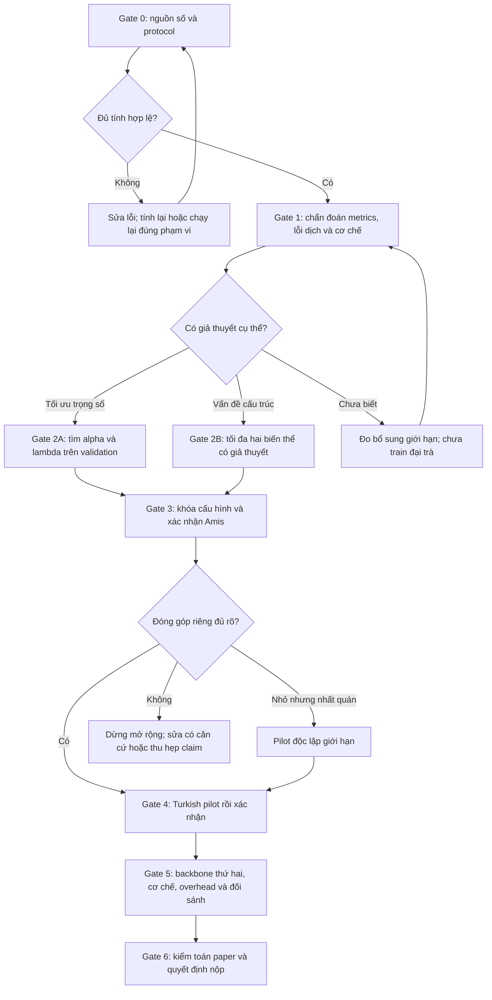

# CLRR: quy trình Go / No-Go để phát triển và kiểm chứng phương pháp

Ngày lập: 03/10/2026. Đây là **kế hoạch**, không phải sổ kết quả hoặc lệnh khởi chạy GPU.

**Điểm dừng mới theo tác giả:** xong Full α0.20/λ0.10/seed42 thì tạm ngưng.
Không tự chạy tiếp theo quyền tự động trước đó. Xem [bàn giao](../operations/CONFIGURATION_SEARCH_HANDOFF.md)
để biết receipts, kết quả cuối và cách phục hồi sáu trial screening còn lại.
Turkish vẫn dừng cho đến khi tác giả cho chạy.

**Cập nhật thực thi:** tác giả đã cho tự chạy các bước cần thiết để tìm cấu hình tốt
và báo insight/kết luận sau khi xong. Influence C hoàn tất; screening D bắt đầu.
Trong budget/scope hiện hành không hỏi lại phép chuyển từng trial/gate; báo tiến độ,
kết quả và dừng khi gate không đạt. Nếu cần mở rộng ngoài budget/protocol, báo cụ thể trước.

## Material Passport

- Phiên bản kế hoạch tiếp theo: sau quick review và lập RESEARCH_INSIGHTS mới, 03/10/2026.
- Nguồn: paper hiện hành, EXPERIMENTS_UPDATED, RESEARCH_INSIGHTS và artifacts A/B/C.
- Đã chuẩn bị 12 predictions C: hashes, 575rows/file, source order và raw targets đạt.
- Chỉ lập kế hoạch trong lượt này; chưa chạy metrics mới, GPU hoặc sửa implementation.
- Bản kế hoạch trước điều chỉnh ngân sách giữ tại
  [archive](archive/CLRR_GO_NOGO_PLAN_before_followup_20261003.md).
- Mục tiêu là kiểm tra giả thuyết phương pháp, chấp nhận cả kết quả bác bỏ.
  Không chọn số đẹp bằng test hoặc cam kết chứng minh phương pháp sẽ thắng.

## Lộ trình chạy và ngân sách mới

Các mục Gate bên dưới là hướng dẫn chi tiết. Bảng này là thứ tự vận hành hiện hành.

| Thứ tự | Việc làm | Lượt train mới tối đa | Câu hỏi/đầu ra |
| --- | --- | ---: | --- |
| 1 | Gate0–1: influence C, character-only chrF, validation audit, tổng hợp 35probes | 0 | Gain có bền với metric/câu? Có lỗi protocol hoặc selection? |
| 2 | Đọc literature gần nhất và đối chiếu công thức, không train | 0 | Điểm mới của detached cross-layer routing so với fusion/dense connections là gì? |
| 3 | Gate2A: screening Full và LSR-only với cùng số trials | 8 | Thử năm cấu hình mỗi nhánh, gồm cấu hình gốc có thể reuse |
| 4 | Gate2A: kiểm tra một Full, matched-lambda LSR và best-tuned LSR trên seeds43/44 | 6 | Lợi ích có lặp trên validation, vượt LSR cùng objective và LSR được tune? |
| 5 | Gate3: final CLRR-only và Full không detach, seeds42/43/44 | 6 | Routing đứng riêng đóng góp gì? Detach có cần thiết? |
| 6 | Gate3: chấm final Amis và quyết định | 0 | GO / GO có điều kiện / NO-GO, không chọn lại theo test |
| 7A | Nếu qua: Turkish pilot bốn nhánh, rồi đủ ba seed nếu pilot phù hợp | 4 + 8 | Kiểm tra độc lập về language/data sau khi khóa phương pháp |
| 7B | Nếu không qua: Gate2B, tối đa hai nâng cấp theo nguyên nhân | 10 | Can thiệp có sửa quan sát dự đoán và cải thiện validation? |
| 8 | Khi cần bảo vệ claim qua backbone: NLLB bốn nhánh | 4 + 8 | Có lặp lại ngoài mBART? Không dùng historical score thay control mới |

**Amis tối đa 20 lượt mới trước nhánh nâng cấp**, nếu baseline/protocol gốc đủ điều
kiện reuse. Trial đã chạy được tính trong budget, kể cả mất weights; không xóa khỏi
inventory để thử thêm. Nếu phải rerun cấu hình gốc vì thiếu validation evidence hoặc
đổi protocol, lập thêm budget trước khi chạy; không gọi đó là reuse đã được chứng nhận.

**20 là trần, không phải phải chạy đủ.** Dừng sớm khi validation không hỗ trợ đi tiếp;
không khởi động cả 20 lượt bằng một lệnh. Nâng cấp tối đa10 lượt là nhánh có điều kiện,
không là sweep mặc định. Turkish và NLLB là budget riêng, chưa khởi động.
Sau từng phép đo hoặc lượt train: lưu artifacts, cập nhật experiments/insight, báo
kết quả có lợi/bất lợi và số budget còn lại. Theo phép thực thi mới, tự chuyển bước
trong budget/scope đã chốt; không hỏi lại mỗi trial. Báo tiến độ mỗi10phút khi phiên theo dõi đang hoạt động.

## 1. Mục tiêu và nguồn bằng chứng

Mục tiêu: xây dựng một phương pháp có đóng góp riêng, chất lượng dịch ổn định,
bằng chứng cơ chế phù hợp và đánh giá trên điều kiện độc lập để chuẩn bị nộp ACL.
Không có mức BLEU hoặc p-value bảo đảm được nhận bài.

- Số paper ban đầu: [experiments gốc đã archive](archive/EXPERIMENTS_ORIGINAL_20261003.md), giữ nguyên.
- Số đã audit và các thí nghiệm mới: [EXPERIMENTS_UPDATED.md](EXPERIMENTS_UPDATED.md).
- Định nghĩa phép đo: [METRICS.md](METRICS.md).
- Bộ 12 lượt matched: `outputs_rebuttal/amis_confirmation_20261003/`.

Không dùng bảng sensitivity, overhead, gradient no-stop-gradient hoặc qualitative
examples lịch sử như bằng chứng đã xác minh. Không thay checkpoint best bằng checkpoint
có test đẹp hơn. Các kết quả của phương pháp còn thuộc phạm vi Amis, gồm ByT5, vẫn phải được báo cáo đầy đủ.

### Các trạng thái quyết định

- **GO:** đủ điều kiện chuyển sang bước đã định.
- **GO có điều kiện:** được làm một pilot/phép đo giới hạn; chưa mở rộng toàn suite.
- **NO-GO cho bước đó:** dừng bước tiếp theo và xử lý nguyên nhân; không đồng nghĩa bỏ toàn dự án.
- **Dừng hướng hiện tại:** ngân sách thử đã hết mà đóng góp vẫn không được hỗ trợ.

Các ngưỡng thực tế dưới đây là **đề xuất chốt trước khi chạy**; không phải chuẩn của ACL.
Nếu thay ngưỡng, phải ghi trước khi xem kết quả vòng tương ứng.

## 2. Sơ đồ quyết định

## Gate 0 — Hợp lệ của số liệu và protocol

**Làm trước, không train:**

1. Lập inventory các run dùng cho quyết định: data hash/order, pretrained revision,
   source hash, seed, LR/WD, batch/accumulation, lengths, language codes, epochs/patience,
   checkpoint selection, generation precision/beams, metric signatures.
2. Đối chiếu COMPLETE, predictions, metrics, audit receipts và HF checkpoint manifest.
3. Phân biệt rõ audit A, reevaluation FP32 B, và suite mới ba seed. Không gộp chúng
   thành một bảng mean/std hoặc một kiểm định.
4. Ghi đủ các mất mát artifacts: hai weights seed 42 thiếu, endpoint baseline seed 42
   thiếu, historical CLRR-only best504 chưa tìm được. Không dùng checkpoint khác thế chỗ.
5. Lập danh sách đối sánh có thể dùng lại. Đồng effective batch chưa đủ chứng minh
   tương đương nếu microbatch/precision/selection khác.

**GO:** các so sánh dự kiến có provenance rõ và dùng protocol phù hợp.

**NO-GO:** số không tái tính được từ predictions, reference/order sai, weights sai,
hoặc khác biệt protocol ảnh hưởng kết luận. Sửa đúng nhóm bị ảnh hưởng trước khi HPO.
Phần hợp lệ khác vẫn được giữ; không cần chạy lại mọi đối sánh.

**Đầu ra:** checklist nguồn số và reuse matrix trong EXPERIMENTS_UPDATED, không tạo sổ điểm thứ ba.

## Gate 1 — Chẩn đoán trước khi sửa phương pháp

### 1A. Metrics và checkpoint selection

- Tính char-only chrF và ảnh hưởng từng câu trên **12 bộ predictions mới**.
  Chẩn đoán tương tự của checkpoint lịch sử đã có; không làm lại vô cớ.
- Đo reference word-ngram sparsity; xác định mức tăng chrF++ nào phụ thuộc vào
  rất ít câu. Giữ toàn bộ test trong kết quả chính.
- Audit cả **validation**: raw chrF++, BLEU và char-only chrF, đặc biệt các epoch cạnh
  checkpoint best nếu predictions tồn tại. Nếu thiếu, chỉ reevaluate một tập checkpoint
  validation định trước khi có đúng weights; không suy thứ hạng từ test.
- Không đổi metric selection chỉ để tăng test. Nếu có bằng chứng selection không phù hợp,
  đăng ký protocol mới trước HPO và chạy lại controls tương ứng.

### 1B. Lỗi dịch và cơ chế

- Tổng hợp 35 mốc trajectory hiện có trên cùng batch: early/middle/late,
  residual theo tầng, CE/LSR gradient theo nhóm encoder/embedding, cosine và rank.
- Mốc actual endpoint khác checkpoint best; không trộn hai loại. Baseline/CLRR-only
  auxiliary gradients chỉ là counterfactual, không phải objective đã train.
- Phân nhóm câu theo đặc điểm source xác định trước: độ dài, mức phân mảnh tokenizer,
  tần suất từ trong train và affix proxy. Báo cả nhóm giảm điểm, cỡ mẫu và uncertainty.
  Proxy regex không là gold morphology; không gọi chrF là độ chính xác affix.
- Kiểm tra các lỗi cụ thể: bỏ nội dung, lặp, độ dài bất thường, sai từ/vai ngữ nghĩa.
  Các nhóm khám phá trên test được ghi exploratory, không làm tiêu chí chọn model.

### Quyết định Gate 1

| Quan sát | Quyết định |
| --- | --- |
| Chỉ gain chrF++ rất lớn; BLEU/char-only không xác nhận | NO-GO cho claim hình thái; giữ protocol và kiểm tra độ bền, chưa tăng lambda |
| Residual có outlier theo tầng/input hoặc gain/harm thay đổi với mức residual | GO thử alpha nhỏ/lớn trong phạm vi đã chốt; nếu cần thì thử kiểm soát độ lớn residual |
| CE–LSR conflict hoặc biểu diễn tập trung dần đi kèm lỗi dịch | GO thử lambda thấp hoặc LSR giảm dần; chưa quy quan hệ quan sát thành nguyên nhân |
| LSR gradient nhỏ nhưng không conflict | GO thử lambda hai phía; không mặc định tăng lambda là lời giải |
| Không thấy lỗi kỹ thuật; Full có lợi ích nhỏ, nhất quán | GO vào sweep trọng số nhỏ |
| Chưa có giả thuyết phân biệt các hướng sửa | Chỉ đo bổ sung giới hạn; NO-GO cho sweep lớn |

**Đầu ra:** một bảng giả thuyết, bằng chứng hỗ trợ/phản bác, phép thử phân biệt và hướng sửa.

## Gate 2A — Tìm trọng số, dùng validation

### Phạm vi ban đầu

Giữ mBART Amis, encoder distance2, LR5e-5, WD0, warmup0.06, train batch32×4,
length256, max20epochs/patience4, BF16 training, FP32 generation,
validation beam1/test beam4 và các phần còn lại của protocol matched hiện có.

Giữ checkpoint selection hiện tại nếu Gate1 không yêu cầu protocol mới.
Nếu đổi selection, phải chạy lại baseline và controls; không dùng lại điểm của protocol cũ
để gọi là matched comparison.

**Vòng screening seed42: Full và LSR-only cùng năm trials, tối đa8 lượt mới.**
Mỗi trial có cùng max epochs, selection, seed và protocol. Đếm trial gốc trong cả
hai nhánh nếu có validation evidence đủ để reuse; báo GPU-time thực tế vì số trial
bằng nhau chưa bảo đảm tổng chi phí hoàn toàn bằng nhau.

| Run | alpha | lambda | Câu hỏi |
| --- | ---: | ---: | --- |
| Full gốc, reuse có điều kiện | 0.10 | 0.10 | Mốc tham chiếu đã chạy |
| Full alpha thấp | 0.05 | 0.10 | Routing hiện tại có quá mạnh? |
| Full alpha cao | 0.20 | 0.10 | Routing hiện tại có quá yếu? |
| Full LSR thấp | 0.10 | 0.03 | Alignment có làm mất phân biệt hữu ích? |
| Full LSR cao | 0.10 | 0.30 | Alignment có chưa đủ lực? |
| LSR-only rất thấp | 0 | 0.01 | LSR yếu có đủ mà không cần routing? |
| LSR-only thấp | 0 | 0.03 | Control cho lợi ích của đổi lambda |
| LSR-only gốc, reuse có điều kiện | 0 | 0.10 | Mốc tham chiếu đã chạy |
| LSR-only cao | 0 | 0.30 | Control cho lợi ích của đổi lambda |
| LSR-only cao hơn | 0 | 0.60 | Control tốt nhất trong cùng số trials có vượt Full? |

Full/LSR-only lambda0.10 và baseline hiện có là mốc tham chiếu nếu Gate0 chứng nhận reuse.
Không chạy lưới 3×3 ngay, không chọn seed có test đẹp, không mở test của các candidate.
Các kiểm tra metrics trên predictions hiện có vẫn tách khỏi việc chọn hyperparameters.

Chọn **một Full candidate và một best-tuned LSR theo validation metric đã chốt**;
xác định thêm LSR cùng lambda với Full, có thể trùng best-tuned LSR. Xét BLEU/char-only
như chỉ báo phụ, không chọn metric thuận lợi sau khi thấy kết quả. Nếu sát nhau, ưu tiên
cấu hình đơn giản hơn hoặc cấu hình gốc theo quy tắc tie-break ghi trước.

### Kiểm tra validation qua seed43/44

- Một Full candidate × hai seeds = tối đa2 lượt Full mới.
- Matched-lambda LSR-only × hai seeds nếu chưa có = tối đa2 lượt controls.
- Best-tuned LSR-only × hai seeds nếu khác matched-lambda và chưa có = tối đa2 lượt.
- Đánh giá cùng pretrained, data order seed tương ứng và budget/selection.
- Giữ danh sách đã chọn trước khi kiểm tra seeds43/44; dùng validation để quyết định
  có tiếp tục xác nhận hay không, không mở test hoặc thay bằng trial test đẹp hơn.
- Công bố toàn bộ trials, khoảng tìm kiếm và chi phí HPO. Đây là tuning có cùng
  số trials ban đầu cho hai nhánh, không phải tối ưu exhaustive hoặc cùng search space.

**GO:** candidate cải thiện validation qua nhiều seed và không có dấu hiệu suy giảm
BLEU/char-only nghiêm trọng hoặc lỗi dịch mới.

**NO-GO:** chỉ một seed tốt, validation không cải thiện, hoặc lợi ích chỉ là cùng mức
LSR-only đạt được khi đổi lambda. Không mở sweep vô hạn; chuyển Gate2B hoặc dừng sửa.
Nếu cần control không detach để phân biệt nguyên nhân trước nâng cấp, chạy đúng
control của Gate3 trong budget Amis còn lại, với cấu hình đã khóa trên validation.
Không cần chạy đủ mọi final ablation của một candidate đã thất bại để chuyển sang chẩn đoán.

**Chi phí tối đa Gate2A:** 8 screening + 2 Full validation + 2 matched-lambda LSR
+ 2 best-tuned LSR =14 lượt mới, giảm khi controls trùng hoặc được reuse hợp lệ.
Đây là trần, không phải số lượt bắt buộc. Không dùng partial training để so với baseline
đã train đủ20epochs như một kết quả cuối.

## Gate 2B — Sửa cấu trúc, chỉ khi có chẩn đoán

Không tự chạy song song nhiều ý tưởng. Chọn **tối đa hai biến thể**, mỗi biến thể phải
định nghĩa trước công thức, lý do, chi phí và đối chứng:

1. **LSR giảm dần theo training:** chỉ ưu tiên khi trajectory chỉ ra tác dụng alignment
   đầu training nhưng compression/conflict cuối. Control là LSR-only dùng cùng schedule.
2. **Kiểm soát độ lớn residual:** chỉ ưu tiên khi residual theo tầng/input có vấn đề.
   Control là original CLRR ở alpha được tune tương đương; không gọi thay đổi này là
   normalization tối ưu nếu chỉ thử một mức.

Hai ví dụ này là giả thuyết, không là kết luận rằng code hiện tại sai.
Nếu vấn đề là nơi đưa routing vào hoặc detach, chọn ablation tương ứng thay một trong
hai biến thể trên; phải đo gradients đúng thời điểm. Không thay mọi thành phần cùng lúc.

### Chọn nâng cấp theo nguyên nhân, không thử tất cả

| Dấu hiệu cần xác nhận | Phép thử phân biệt | Hướng nâng cấp có điều kiện | Control bắt buộc |
| --- | --- | --- | --- |
| Gain chủ yếu từ chrF++ sparse word ngrams | Influence/char-only trên test và selection audit validation | Sửa selection nếu có căn cứ; chưa sửa architecture | Rerun bốn nhánh theo protocol mới nếu đổi selection |
| Gradient conflict cuối training đi cùng lỗi dịch | CE/LSR cosine, norms trước clip, matched late checkpoints | Giảm lambda hoặc LSR decay schedule | LSR-only cùng schedule và tuning budget |
| Residual có outlier tầng/câu và liên quan harm | Phân bố RMS ratio, alpha controls, length groups | Giới hạn/chuẩn hóa độ lớn residual với hệ số cố định trước | Original CLRR được tune alpha trong budget tương đương |
| No-detach tốt hơn trên validation qua seed | Full detached vs attached, cùng cấu hình và gradients | Bỏ detach hoặc thu hẹp nơi detach | Detached original; không claim detach cần thiết nếu không được hỗ trợ |
| Gain khác nhau theo tầng, có giả thuyết từ probes | Ablation vị trí/distance định trước | Routing một nhóm tầng/distance khác | Original d2; LSR-only; không chọn tầng bằng test |
| Không thấy lỗi, Full chỉ ngang best-tuned LSR | Matched objective và tuning controls | Đánh giá lại giá trị riêng CLRR trước thay cấu trúc | Best-tuned LSR và baseline |

Mỗi nâng cấp phải ghi trước công thức, số added/trainable parameters, dự đoán
diagnostic sẽ thay đổi, metric validation, controls và điều kiện bác bỏ.
Ưu tiên schedule hoặc hệ số cố định nếu muốn giữ parameter neutrality; learned
gates tạo thêm tham số thì phải đổi mô tả phương pháp và báo đúng số.

**Ngân sách nâng cấp:** tối đa2 Full screening runs cho hai giả thuyết; chỉ một
candidate có validation tốt hơn được thêm seeds43/44 (2runs). Dành tối đa6 lượt
còn lại cho controls của hai giả thuyết và confirmation phù hợp: tổng không quá10.
Khóa inventory cụ thể trước từng nhánh. Nếu controls/final ablations cần hơn budget
còn lại hoặc protocol phải đổi, báo phạm vi/chi phí mới trước khi khởi động; 10 lượt
không tự bảo đảm đã đủ mọi control cho bất kỳ nâng cấp nào. Không train nếu
giả thuyết không dự đoán được quan sát sẽ thay đổi thế nào.

**GO:** cải thiện validation lặp lại và diagnostics đổi theo dự đoán, implementation gates đạt.

**NO-GO:** không cải thiện, chỉ thắng sau thay nhiều protocol, hoặc gains biến mất khi
so control tương ứng. Hết hai biến thể mà không có bằng chứng thì dừng hướng này,
không tiếp tục đổi phương pháp dựa trên test.

## Gate 3 — Khóa phương pháp và đánh giá Amis

Trước test: khóa source hash, alpha/lambda/schedule, selection, metrics, seeds và
comparison family. Dùng candidate weights đã chọn bằng validation; không cần train lại
chỉ để có lượt gọi là confirmation nếu weights đó đã đúng protocol.

### Các so sánh bắt buộc

1. Final Full vs Baseline cùng protocol/seed.
2. Final Full vs LSR-only **cùng lambda/schedule**, đồng thời báo LSR-only tốt nhất
   trong ngân sách validation đã khai báo.
3. CLRR-only phù hợp với routing cuối: nếu alpha/structure đổi, chạy lại ablation này;
   không dùng CLRR-only alpha0.1 để đại diện cấu hình khác.
4. Report tất cả seed scores, mean/std, paired deltas, corpus bootstrap và family correction.
   Sentence bootstrap không thay inference qua training seeds.

### Hai control cơ chế chính: tối đa6 lượt

- Final CLRR-only ×3seeds nếu routing cuối khác cấu hình gốc: tối đa3 lượt.
- Final Full nhưng bỏ detach riêng ở **cached CLRR source** ×3seeds: tối đa3 lượt.
  Giữ target LSR no_grad và mọi thành phần khác nguyên; không đồng thời bỏ target detach.
- Control không detach chỉ thay routing source gradient, phải kiểm tra forward
  equivalence trước update, gradients, cache isolation và gradient checkpointing.
- Script `run_no_stop_gradient.py` cũ là mT5/5epochs, không dùng nguyên script đó
  để gọi là matched mBART control. Trainer hiện cache detached source; cần option
  có kiểm chứng trước khi chạy.
- Ghi pre-clipping gradients, validation scores và loss; NaN/OOM cần phân biệt lỗi
  implementation với instability. Nếu thay microbatch/precision để chạy control,
  kiểm tra/retrain đối sánh tương ứng; không đổi riêng rồi gọi matched.
- Nếu no-detach ngang hoặc tốt hơn, bỏ claim detach thiết yếu; nếu detached tốt
  hơn chỉ trên một seed thì chưa kết luận cơ chế. Fixed-weight route-off không thay control này.

Ba seeds42/43/44 là vòng phát triển tiếp theo trên benchmark **đã được xem test**.
Ghi rõ đây không phải holdout chưa từng được sử dụng. Gắn vòng mới nhãn D;
không sửa Holm24 của C. Trước test D chốt family chính Holm18 cho Full−Baseline,
Full−matched-lambda LSR, Full−best-tuned LSR ×2metrics ×3seeds. Nếu hai LSR trùng,
chấm một output và báo rõ trùng control; các slot kiểm định trùng được đặt p=1
để giữ family18 bảo thủ đã định trước, không tính thành bằng chứng độc lập.
Ba ablations CLRR-only−Baseline, Full−CLRR-only và Full−no-detach có family phụ
Holm18 riêng; không chọn ablation có lợi rồi bỏ phần còn lại. Character-only chrF
và subgroup là exploratory diagnostics, không gọi significant bằng các family này.
Nếu triển khai statistics cần điều chỉnh protocol trước test, ghi manifest thay đổi;
không đổi correction sau khi thấy p. Mọi kết quả dùng mean/std và paired deltas qua
seed; không suy seed-population significance từ sentence bootstrap.

### Ngưỡng quyết định đề xuất

| Trạng thái | Điều kiện | Hành động |
| --- | --- | --- |
| GO | Mean Full−Baseline >=0.5 BLEU; Full−matched LSR >=0.3; Full thắng matched LSR ở3/3seeds, baseline ít nhất2/3; mean Full−best-tuned LSR >0; chrF/chrF++ không có suy giảm hệ thống | Tiếp tục pilot độc lập Gate4; chưa tuyên bố thắng chắc nếu CI/p chưa hỗ trợ |
| GO có điều kiện | Gain nhỏ hơn ngưỡng nhưng Full−matched LSR dương3/3seeds, mean Full−best-tuned LSR >0, không có harm hệ thống hoặc vấn đề metrics | Chỉ một Turkish pilot4nhánh; chưa chạy mọi backbone |
| NO-GO | Mean Full−matched LSR <=0, hoặc không hơn best-tuned LSR trong vòng đã chốt, hoặc chỉ tốt ở một seed, hoặc gain chỉ do rare-ngram, hoặc lỗi dịch/collapse đáng kể | Dừng mở rộng; Gate2B nếu có giả thuyết và chưa hết ngân sách, nếu hết thì thu hẹp/bỏ hướng hiện tại |

Các ngưỡng là mức đầu tư dự án, không là ranh giới significance. Không coi nonsignificance
là bằng nhau. GO không cho phép claim vượt trội thống kê khi CI/p không hỗ trợ.
Nếu chênh lệch với best-tuned LSR sát0 và uncertainty rộng, ghi chưa phân biệt được;
chưa tiếp tục suite lớn. Không kết luận universal ineffectiveness từ NO-GO của ngân sách này.
Ba seed chưa chứng minh stability tổng quát; nếu cần thêm seeds, chốt số và budget trước
vòng bổ sung, không thêm dần đến khi p<0.05.

## Gate 4 — Turkish→English 20k: bằng chứng độc lập

Chỉ chạy khi tác giả cho phép Turkish và phương pháp đã khóa.

- Data: `data_processed/opus100_turkish_english_20k_v2/`, giữ pinned revision/hash,
  official test2000 và báo duplicate-excess đã biết; không chọn lại test rows.
- mBART tr_TR→en_XX; BLEU13a, raw chrF++; pretrained và generation precision thống nhất.
- Bốn nhánh: Baseline, CLRR-only, LSR-only, Full. Routing/LSR ablations khớp final method.
- Pilot seed42: **4 training runs**. Không mặc định final phương pháp vượt zero-shot;
  zero-shot chỉ là mốc kiểm tra phù hợp dữ liệu/pipeline.
- Chuyển cấu hình đã khóa từ Amis, không tune Turkish theo test. Nếu phải tune trên
  Turkish validation, công khai budget và không gọi là chuyển nguyên cấu hình.

**Pilot GO:** Full−Baseline và Full−LSR đều dương trên BLEU; chrF++ không giảm và
không có lỗi implementation. Nếu sát0 hoặc metrics bất đồng: chỉ GO có điều kiện
sau khi xem validation/errors, không gọi pilot là generalization đã chứng minh.

**Pilot NO-GO:** Full kém rõ hoặc lợi ích chỉ đến từ LSR-only; dừng thêm seeds.
Không loại Turkish khỏi báo cáo. Nếu dùng kết quả pilot để sửa phương pháp, Turkish test
không còn là confirmation độc lập; cần một holdout/dataset chưa xem cho claim đó.

**Xác nhận:** nếu pilot qua, thêm seeds43/44 đủ4nhánh =8runs; tổng Turkish12runs.
Trước vòng này chốt statistics/primary comparisons, không tự suy p từ pilot một seed.

**Gate4 GO:** lợi ích riêng Full−LSR lặp lại, Full có lợi so baseline trên hai datasets,
không dựa vào một seed/câu; báo uncertainty và mức tăng thực tế.
**Gate4 NO-GO:** không có contribution riêng trên Turkish hoặc giảm chất lượng ổn định.
Thu hẹp phạm vi claim; chưa đủ để kể câu chuyện phương pháp tổng quát.

## Gate 5 — Hoàn thiện đóng góp và sức thuyết phục

### Backbone thứ hai

Ưu tiên **NLLB** để kiểm tra một backbone dịch đa ngữ mạnh; **mT5** có thể dùng trước
nếu cần xác định thành phần với chi phí thấp hơn, nhưng phải nêu chất lượng tuyệt đối thấp.
Pilot đủ4nhánh, nếu có gain mới mở3seeds. Không gộp Amis NLLB lịch sử một seed vào
matched multi-seed mới. Giữ kết quả ByT5 âm tính và giải thích phạm vi hỗ trợ được.

### Cơ chế và morphology

- Đo selected-best final model và controls trên cùng rows: residual, full spectrum,
  gradient CE/LSR; phân biệt với trajectory endpoint.
- Nếu claim bảo toàn hình thái là trung tâm: cần đánh giá task-specific có nhãn hợp lệ,
  hoặc annotator biết ngôn ngữ, chấm blind và sampling xác định trước, cỡ mẫu đủ theo
  precision/power mục tiêu. Regex/probe/chrF một mình không đủ.
- Rerun affix probe với raw artifacts, split train/dev/test cho probe và controls;
  công khai cả F1 giảm. Không giải thích F1 giảm thành distributed encoding nếu chưa đo.
- Nếu claim detach cần thiết: train matched no-stop-gradient control, đo trước clip/zero_grad.
  Đếm đường đi không chứng minh gradient explosion hoặc ổn định tuyệt đối.

### Hiệu quả tính toán và đối sánh

- Benchmark cùng hardware, batch, lengths, precision, decoding; warmup, synchronize,
  repeated measurements. Báo latency distribution, peak memory và training cost với
  LSR target forward. Không lấy runtime có probes làm overhead thuần.
- Strong LoRA có thể giữ như kết quả các cấu hình đã thử. Nếu claim outperform PEFT
  nói chung là trung tâm, phải bổ sung HPO budget hợp lý và matched inference; không
  dùng khác LR/embeddings đồng thời để quy nguyên nhân cho embeddings.
- Middle-Align là control cạnh tranh quan trọng: nếu thành baseline tốt nhất, final method
  phải được đối chiếu công bằng; không chỉ so với vanilla yếu hơn.

**GO:** các claim chính có đúng controls, improvement/uncertainty và artifacts hỗ trợ.
**NO-GO:** chất lượng chỉ hơn control yếu, mechanism claim dựa proxy chưa chứng nhận,
hoặc overhead claim thiếu benchmark. Bổ sung đúng phép đo hoặc bỏ claim đó.

## Gate 6 — Quyết định về bản thảo

| Tình huống cuối | Quyết định |
| --- | --- |
| Contribution riêng vượt controls mạnh, lặp lại qua seeds và dataset; cơ chế có bằng chứng; báo cáo tái lập được | GO chuẩn bị submission ACL; vẫn không có bảo đảm acceptance |
| Gain nhỏ nhưng đáng tin trong một phạm vi rõ; phân tích điều kiện giúp/hại có insight | GO có điều kiện: định vị bài hẹp theo bằng chứng; đánh giá độ mới và đóng góp, không ép claim phổ quát |
| Full không hơn tuned LSR/control mạnh sau hết budget; có negative results lặp lại | NO-GO cho narrative CLRR improvement hiện tại; cân nhắc phương pháp khác hoặc một nghiên cứu phân tích có câu hỏi riêng |
| Số đẹp nhưng sai protocol, test-driven selection hoặc thiếu provenance | NO-GO bất kể độ lớn gain; sửa trước submission |

Trước sửa paper: rà mọi số/significance/example/theorem. Giữ bản paper gốc đóng băng;
chỉ sửa bản mới được tác giả chọn. Đối chiếu toàn bộ claim với source artifacts, report
all trials và không xóa kết quả âm tính. Không coi hoàn tất checklist là bằng chứng novelty.

## 3. Vận hành bắt buộc khi được cho chạy

1. Python/data/tests/training trong conda `clrr`; GPU A100 Standard, không high-mem.
2. Dataset dưới `data_processed/<dataset_name>/`, source,target, đủ3splits.
3. Mỗi run một ID/config hash riêng; không ghi đè runs/HF folders cũ.
4. Không evaluate candidate test trước khóa cấu hình. Logs phải tách validation/test.
5. Giữ best model + config/tokenizer + run manifest; upload HF sau từng run,
   xác minh byte count và SHA-256 trước xóa ZIP local. Không để weights chỉ nằm trên VM.
6. Predictions/metrics/probes lưu riêng local; ghi điểm từ artifacts vào
   EXPERIMENTS_UPDATED. METRICS chỉ lưu protocol; EXPERIMENTS gốc giữ nguyên.
7. Báo chat mỗi10phút khi phiên theo dõi hoạt động, ngay khi run hoàn tất/lỗi.
   Supervisor phải sống độc lập với host chat; nếu host ngắt thì log nền còn, nhưng
   không coi log nền là một thông báo chat đã gửi.
8. Sau mỗi gate báo GO/GO có điều kiện/NO-GO, số run đã dùng và phần còn thiếu.
   Không mở rộng ngoài budget đã chốt; GPU dừng sau backup nếu không có bước được phép.

## 4. Bước cần làm ngay

**Gate0 rồi Gate1.** Chưa khởi động sweep hoặc Turkish.
Sau đó chốt protocol/thresholds/budget của Gate2A dựa trên chẩn đoán đã tổng hợp.
Không cần train lại toàn bộ PEFT ngay; có thể phải chạy thêm LSR/CLRR controls
nếu trọng số hoặc phương pháp thay đổi.

Đầu vào influence C đã đạt preflight; thực hiện phép đo này trước, sau đó báo
những số mới có lợi/bất lợi và việc còn thiếu. Không cần tải checkpoints cho bước này.
Không dùng script influence A hoặc no-stop-gradient mT5 cũ để đại diện suite mới.

### Báo cáo bắt buộc khi hết ngân sách hoặc qua gate

1. **Kết luận hiệu quả:** Full−Baseline, Full−matched LSR và Full−best-tuned LSR,
   mỗi seed/mean/uncertainty; controls detach và CLRR-only có nói cùng câu chuyện không?
2. **Nguyên nhân:** tách lỗi kỹ thuật đã xác nhận, metric sensitivity đã đo,
   selection confound, và giả thuyết cơ chế chưa có bằng chứng can thiệp.
3. **Nâng cấp:** chỉ chọn hướng có phép thử phân biệt; ghi lợi ích/chi phí/controls
   và dự đoán có thể bị bác bỏ. Nếu chưa tìm được nguyên nhân, nói chưa biết;
   không mặc định là overfitting hoặc lambda thấp.
4. **Quyết định:** GO mở rộng, GO có điều kiện pilot, hoặc NO-GO cho narrative
   cải thiện hiện tại. Sau tối đa hai nâng cấp không qua validation/controls,
   dừng sweep; báo phương pháp chưa đủ hỗ trợ claim chính trong phạm vi đã thử.
5. **Paper:** có thể giữ kết quả hẹp hoặc phân tích điều kiện giúp/hại nếu có insight;
   không bảo đảm ACL bằng threshold, không xóa negative results, không viết kết quả chưa chạy.
